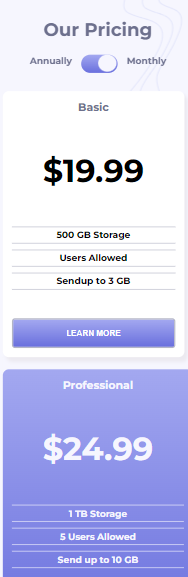

# Frontend Mentor - Pricing component with toggle solution

This is a solution to the [Pricing component with toggle challenge on Frontend Mentor](https://www.frontendmentor.io/challenges/pricing-component-with-toggle-8vPwRMIC). Frontend Mentor challenges help you improve your coding skills by building realistic projects. 

## Table of contents

- [Frontend Mentor - Pricing component with toggle solution](#frontend-mentor---pricing-component-with-toggle-solution)
  - [Table of contents](#table-of-contents)
  - [Overview](#overview)
    - [The challenge](#the-challenge)
    - [Screenshot](#screenshot)
    - [Links](#links)
  - [My process](#my-process)
    - [Built with](#built-with)
    - [What I learned](#what-i-learned)
    - [Continued development](#continued-development)
    - [Useful resources](#useful-resources)
  - [Author](#author)
  - [Acknowledgments](#acknowledgments)


## Overview

### The challenge

Users should be able to:

- View the optimal layout for the component depending on their device's screen size
- Control the toggle with both their mouse/trackpad and their keyboard
- **Bonus**: Complete the challenge with just HTML and CSS

### Screenshot
Desktop:


Mobile:

### Links

- Solution URL: [my solution](https://www.frontendmentor.io/solutions/interactive-pricing-component-Skg7N5OHHc)
- Live Site URL: [my live site](https://purplehippo911.github.io/pricingComponent)

## My process

### Built with

- Semantic HTML5 markup
- CSS custom properties
- Flexbox
- Mobile-first workflow
- Vanilla JS


### What I learned

I learned how to make and style a toggle switch, I became more comfortable with writing in JS and with using CSS flexbox when aligning elements. I also learnt how to react to keyboard inputs with Javascript.

```html
 <header>
        <h1>Our Pricing</h1>
        <section>
          Annually
          <div class="toggle"><span class="ball"></span></div>
          Monthly
        </section>
      </header>
```
```css
.toggle .ball {
    width:2rem;
    height:1.9rem;
    padding:0.5rem;
    border-radius:100%;
    box-shadow:1px 1px 1px 1px hsla(0, 6%, 75%, 0.2);
    position:absolute;
    top:0px;
    right:2px;
    background-color:var(--VeryGrayishBlue);
    color:white;
    transition:cubic-bezier(0.95, 0.05, 0.795, 0.035);
}

```
```js
unction toggleOn() {
    i++;
    ball.classList.add('active');
    price1.textContent = "$199.99";
    price2.textContent = "$249.99";
    price3.textContent = "$399.99";
    console.log('hi')
    if(i == 2 || i == 4 || i == 6 || i == 8 || i == 10 || i == 12 || i == 14 || i == 16 || i == 18 || i == 20 || i == 22) {
        ball.classList.remove('active');
        price1.textContent = "$19.99";
        price2.textContent = "$24.99";
        price3.textContent = "$39.99";
    }
}

```


### Continued development

I am planning on learning Grid and continuing on to the junior challenges at frontend mentor soon. I am thinking of making my own little website for fun, but I'm not sure. I'll hopefully do it.

### Useful resources

- [Git Branches](https://www.youtube.com/watch?v=qY6IooRlNGI) - This helped me with making getting used to making branches in git. I really liked his videos explaining git and github and will use it going forward.
- [Keyboard Events](https://www.delftstack.com/howto/javascript/javascript-keyboard-input/) - This is an amazing article which helped me with the Keyboard Event. 


## Author

- Github - [@purplehippo911](https://github.com/purplehippo911)
- Frontend Mentor - [@purplehippo911](https://www.frontendmentor.io/profile/purplehippo911)
-  Discord - [mashedapples222#7574]


## Acknowledgments

Thanks to @dpayne713 for her/his solution which helped me on my some of my CSS. Here's the repository: [@dpayne713](https://github.com/dpayne713/frontEndMentor-pricingComponent)
